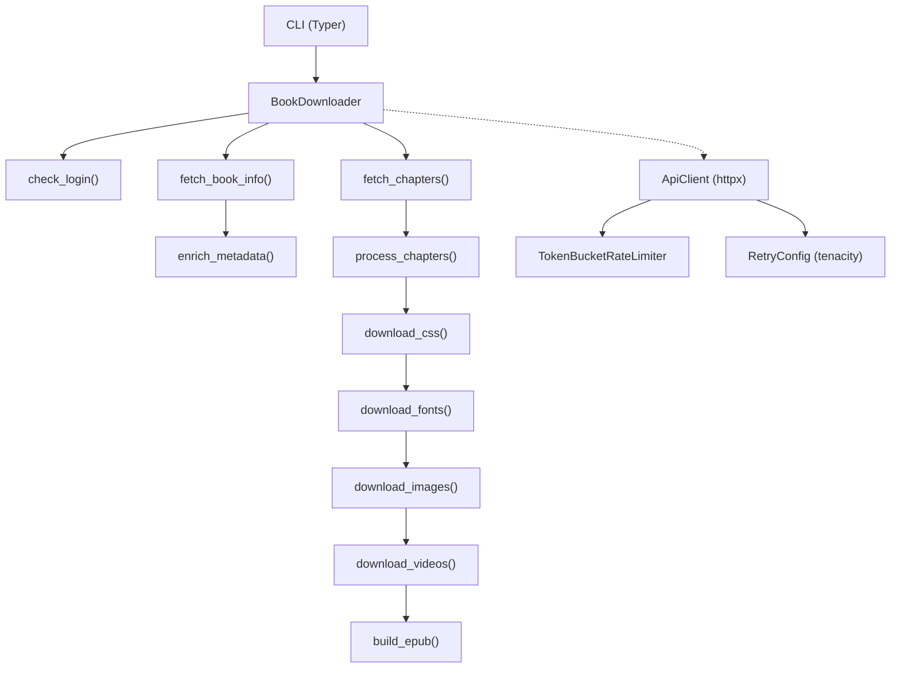

[](https://pypi.org/project/safaribooks/)
[](https://www.python.org/downloads/)
[](LICENSE.md)
[](https://github.com/joeblackwaslike/safaribooks/actions/workflows/main.yml)
[](https://github.com/astral-sh/ruff)

# safaribooks

> Download O'Reilly books as EPUB files. Async. Cookie-based auth that actually works.

For personal and educational use only. Please read O'Reilly's [Terms of Service](https://learning.oreilly.com/terms/).

---

<p align="center">
  
</p>

<details>
<summary>Text fallback (if the GIF doesn't load)</summary>

```
$ safari auth setup
Paste cookies (JSON, header, or extension export):
{"groot_sessionid":"abc...","logged_in":"y","jwt":"eyJ...","csrf_access_token":"tok_..."}
Cookies saved to ~/.config/safaribooks/cookies.json (4 cookies)

$ safari fetch 9781491958698
Downloading 1 book(s)...

──── Book 1/1: 9781491958698 ────
  Fetching book info...        ━━━━━━━━━━━━━━━━━━━━ 100%  0:00:01
  Downloading chapters (53)... ━━━━━━━━━━━━━━━━━━━━ 100%  0:00:12
  Downloading CSS (2 files)... ━━━━━━━━━━━━━━━━━━━━ 100%  0:00:01
  Downloading images (142)...  ━━━━━━━━━━━━━━━━━━━━ 100%  0:00:08
  Building EPUB...             ━━━━━━━━━━━━━━━━━━━━ 100%  0:00:01
Saved: Books/Test-Driven Development with Python 2nd Edition (9781491958698)/9781491958698.epub

──── Summary ────
Downloaded: 1 book(s)
```

</details>

---

## Install

<details open>
<summary><strong>uv (Recommended)</strong></summary>

```bash
uv tool install safaribooks
```

</details>

<details>
<summary><strong>pip</strong></summary>

```bash
pip install safaribooks
```

</details>

<details>
<summary><strong>Docker</strong></summary>

```bash
docker build . -t safaribooks

# Extract cookies on host first:
safari auth setup

# Run:
docker run --rm \
    -e SAFARI_COOKIES_FILE=/app/cookies.json \
    -v $(pwd)/cookies.json:/app/cookies.json \
    -v $(pwd)/Books:/app/Books \
    safaribooks 9781491958698
```

</details>

---

## Quick Start

1. **Set up authentication** -- paste cookies from your browser:
   ```bash
   safari auth setup
   ```

2. **Download a book by ID:**
   ```bash
   safari fetch 9781491958698
   ```

3. **Download an entire playlist:**
   ```bash
   safari fetch --playlist 6f612b99-bebc-41e1-8fff-6b655507b7af
   ```

4. **Search by title:**
   ```bash
   safari fetch "Python Cookbook"
   ```

---

## Why This Exists

O'Reilly killed programmatic login years ago, and the v1 API that the original `safaribooks` tool relied on was eventually shut down. The [upstream repo](https://github.com/lorenzodifuccia/safaribooks) is unmaintained and no longer functional.

This fork synthesized **20+ community PRs** into a modern async rewrite: `httpx` instead of `requests`, `tenacity` for retries, a token-bucket rate limiter, Pydantic v2 config, and a proper `typer` CLI. It migrated the entire API surface from v1 to v2 and unified cookie authentication into a single workflow.

See the [archived contributors page](docs/archive/CONTRIBUTORS.md) for full credit.

---

## CLI Reference

### Commands

| Command | Description |
|---------|-------------|
| `safari fetch <IDs/URLs/titles>` | Download books by ID, URL, or title search |
| `safari fetch --playlist UUID` | Download all books from a playlist |
| `safari fetch --file list.txt` | Batch download from a file |
| `safari auth setup` | Interactive cookie paste (auto-detects format) |
| `safari auth extract --browser chrome` | Auto-extract cookies from browser |
| `safari auth import --header "Cookie: ..."` | Import from raw cookie header |
| `safari auth import --file cookies.json` | Import from file (JSON or extension format) |
| `safari auth validate` | Check if cookies are still valid |
| `safari auth status` | Show cookie file location and info |

### Fetch Options

| Option | Default | Description |
|--------|---------|-------------|
| `--kindle` | off | Add Kindle-compatible CSS for e-readers |
| `--output` / `-o` | `Books/` | Output directory |
| `--library-dir` | `~/.safaribooks/` | Central library for collected EPUBs |
| `--rate-limit` / `-r` | `1.0` | Max requests per second (0=unlimited) |
| `--rate-burst` | `2` | Rate limiter burst capacity |
| `--image-max-size` | `0` | Resize images if dimension exceeds N pixels (0=no resize) |
| `--image-quality` | `0` | JPEG compression quality 1-95 (0=keep original) |
| `--ssl-skip` | off | Skip SSL certificate verification |
| `--preserve-log` | off | Keep log file even without errors |
| `--debug` | off | Enable debug logging |

---

## Authentication Methods

O'Reilly blocks programmatic login. You need cookies from an active browser session.

**Step 1:** Log in at [https://learning.oreilly.com](https://learning.oreilly.com) in your browser.

**Step 2:** Get cookies via one of these methods:

### Method 1: Interactive Paste (Recommended)

```bash
safari auth setup
```

Auto-detects JSON dict, browser extension export, or raw cookie header. Get JSON from your browser console:

```javascript
JSON.stringify(document.cookie.split(';').reduce((o,c) => {
  c = c.trim(); let i = c.indexOf('=');
  o[c.substring(0, i)] = c.substring(i + 1); return o;
}, {}))
```

### Method 2: Raw Cookie Header

```bash
safari auth import --header 'Cookie: k1=v1; k2=v2; ...'
```

### Method 3: Browser Extension Export

```bash
safari auth import --file exported_cookies.json
```

### Method 4: Auto-Extract from Browser

```bash
pip install browser_cookie3
safari auth extract --browser chrome
```

Also supports: `firefox`, `edge`, `chromium`.

### Method 5: Manual JSON

Create `~/.config/safaribooks/cookies.json`:

```json
{
  "groot_sessionid": "...",
  "logged_in": "y",
  "jwt": "...",
  "csrf_access_token": "..."
}
```

Required cookies: `groot_sessionid`, `jwt`, `csrf_access_token`, `logged_in`.

**Validate:** `safari auth validate`

### Troubleshooting

| Problem | Solution |
|---------|----------|
| "Out-of-Session" error | Cookies expired (~2 hours). Re-extract them. |
| "No cookies found" | Make sure you're logged in at learning.oreilly.com |
| Browser extract fails | Close browser first, or use paste mode |
| Download interrupted | Session expired mid-download. Re-extract and press Enter. |

> **Security warning:** `cookies.json` contains your active session -- treat it like a password. It's in `.gitignore`.

---

## Configuration

All settings can be set via environment variables with the `SAFARI_` prefix (powered by pydantic-settings):

| Env Var | CLI Flag | Default | Description |
|---------|----------|---------|-------------|
| `SAFARI_COOKIES_FILE` | -- | `~/.config/safaribooks/cookies.json` | Cookie file path |
| `SAFARI_OUTPUT_DIR` | `--output` | `Books/` | Output directory |
| `SAFARI_LIBRARY_DIR` | `--library-dir` | `~/.safaribooks/` | Central library |
| `SAFARI_KINDLE` | `--kindle` | `false` | Kindle mode |
| `SAFARI_RATE_LIMIT` | `--rate-limit` | `1.0` | Requests per second |
| `SAFARI_RATE_BURST` | `--rate-burst` | `2` | Burst capacity |
| `SAFARI_DEBUG` | `--debug` | `false` | Debug logging |

---

## Architecture



---

## Docker Usage

The Docker image uses `uv` and runs `safari fetch` as the entrypoint:

```bash
# Build the image
docker build . -t safaribooks

# Extract cookies on host first
safari auth setup

# Run a download
docker run --rm \
    -e SAFARI_COOKIES_FILE=/app/cookies.json \
    -v $(pwd)/cookies.json:/app/cookies.json \
    -v $(pwd)/Books:/app/Books \
    safaribooks 9781491958698
```

To pass additional flags, append them after the book ID:

```bash
docker run --rm \
    -e SAFARI_COOKIES_FILE=/app/cookies.json \
    -v $(pwd)/cookies.json:/app/cookies.json \
    -v $(pwd)/Books:/app/Books \
    safaribooks 9781491958698 --kindle --rate-limit 0.5
```

---

## Calibre / E-Reader Tips

The EPUB generated by `safari fetch` is functional but contains raw HTML/CSS from O'Reilly. For the best reading experience, convert it with [Calibre](https://calibre-ebook.com/):

```bash
ebook-convert \
    "Books/Test-Driven Development with Python 2nd Edition (9781491958698)/9781491958698.epub" \
    "Books/Test-Driven Development with Python 2nd Edition (9781491958698)/9781491958698_clean.epub"
```

For **Kindle** users:

- Use `safari fetch --kindle 9781491958698` to add CSS rules that prevent table and code block overflow on e-ink screens.
- Convert to AZW3 or MOBI with Calibre. When converting, select **Ignore margins** in the conversion options for best results.

---

## Contributing

```bash
uv sync              # install deps
make check           # lint + format + type check
make test            # run tests
```

See [CONTRIBUTING.md](CONTRIBUTING.md) for the full guide.

---

## Credits

Originally created by [Lorenzo Di Fuccia](https://github.com/lorenzodifuccia). This fork synthesized 20+ community contributions -- see [full credits](docs/archive/CONTRIBUTORS.md).
