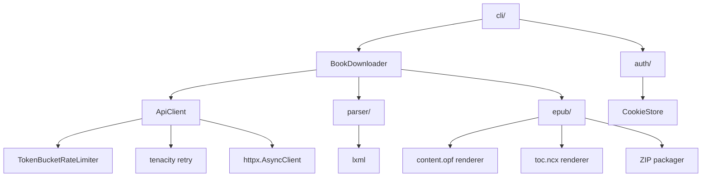
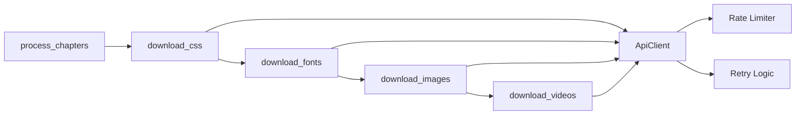

# Architecture

safaribooks is organized as a layered async pipeline. The CLI dispatches to the `BookDownloader`, which orchestrates all download and packaging logic.

## Module dependency diagram

## Download pipeline

The `BookDownloader.run()` method orchestrates the full download:

### Stages explained

| Stage | Description |
|-------|-------------|
| **check_login** | Validates stored cookies against the API |
| **fetch_book_info** | Gets book metadata (title, authors, ISBN, TOC) from the v2 API |
| **enrich_metadata** | Resolves additional publisher/subject data |
| **fetch_chapters** | Downloads each chapter's HTML content sequentially |
| **process_chapters** | Parses HTML with lxml, rewrites internal links, discovers assets |
| **download_assets** | Fetches CSS, fonts, images, and videos sequentially in that order |
| **render_content_opf** | Generates the OPF manifest and spine |
| **render_toc_ncx** | Generates the NCX table of contents |
| **build_epub** | Packages everything into a ZIP with EPUB structure |

## Sequential asset downloads

Asset types are downloaded sequentially -- CSS first, then fonts, then images, then videos. Each download method awaits in order. Within each asset type, individual files go through the shared `ApiClient` which enforces rate limiting.

## Key design decisions

- **Async-first**: All I/O operations use `async`/`await` for efficient concurrency
- **Pydantic v2 models**: Type-safe data throughout the pipeline with runtime validation
- **Separation of concerns**: CLI, API client, HTML parser, and EPUB builder are independent modules
- **Rate limiting at the client level**: The `ApiClient` handles both retry logic and rate limiting, so no calling code needs to worry about it
- **lxml for HTML parsing**: Reliable, fast HTML parsing with XPath support for link rewriting
