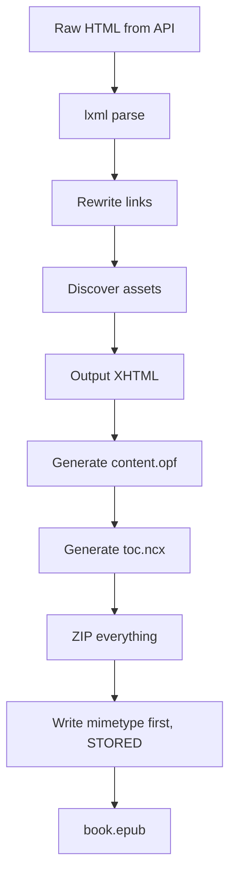

# EPUB Structure

EPUB is a ZIP archive with a specific directory layout and XML metadata files. safaribooks builds standards-compliant EPUB 2.0.1 files.

## What's in the ZIP

An EPUB is a ZIP file with the following structure:

```
book.epub (ZIP)
├── mimetype                          # Must be first, STORED (no compression)
├── META-INF/
│   └── container.xml                 # Points to the OPF file
└── OEBPS/
    ├── content.opf                   # Package manifest + reading order
    ├── toc.ncx                       # Table of contents (navigation)
    ├── chapter001.xhtml              # Chapter content files
    ├── chapter002.xhtml
    ├── ...
    ├── Styles/
    │   ├── style001.css
    │   └── ...
    ├── Images/
    │   ├── cover.jpg
    │   ├── figure001.png
    │   └── ...
    └── Video/
        └── ...
```

## Key files

### mimetype

A plain text file containing exactly `application/epub+zip`. It must be the first entry in the ZIP and must be stored without compression (ZIP STORED method).

### META-INF/container.xml

Points the reader to the OPF file:

```xml
<?xml version="1.0"?>
<container version="1.0" xmlns="urn:oasis:names:tc:opendocument:xmlns:container">
  <rootfiles>
    <rootfile full-path="OEBPS/content.opf" media-type="application/oebps-package+xml"/>
  </rootfiles>
</container>
```

### OEBPS/content.opf

The package document containing:

- **Metadata**: title, authors, ISBN, publisher, language, date
- **Manifest**: every file in the EPUB with its media type
- **Spine**: reading order of the XHTML chapter files

### OEBPS/toc.ncx

Navigation document with nested `navPoint` elements forming the table of contents. safaribooks generates this from the recursive `TocEntry` model parsed from the API response.

### Chapter XHTML files

Each chapter is a well-formed XHTML document. safaribooks:

1. Fetches the raw HTML from the API
2. Parses it with lxml
3. Rewrites all internal links (images, CSS, cross-references) to use relative paths within the EPUB
4. Discovers and queues assets (images, CSS, videos) for download
5. Outputs clean XHTML

## Build process



## EPUB validation

The generated EPUBs conform to EPUB 2.0.1. You can validate them with [epubcheck](https://github.com/w3c/epubcheck):

```bash
java -jar epubcheck.jar "Fluent Python 2nd Edition.epub"
```
