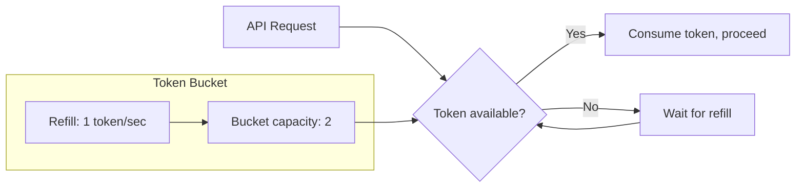

# Rate Limiting

safaribooks uses a token bucket algorithm to limit the rate of API requests, preventing you from being throttled or banned by O'Reilly's servers.

## How it works

The `TokenBucketRateLimiter` maintains a bucket of tokens:

- Tokens are added at a fixed rate (default: 1 per second)
- Each request consumes one token
- If no tokens are available, the request waits until one is replenished
- The bucket has a maximum capacity (burst) that allows short bursts of rapid requests



## Configuration

| Flag | Environment Variable | Default | Description |
|------|---------------------|---------|-------------|
| `--rate-limit` / `-r` | `SAFARI_RATE_LIMIT` | `1.0` | Tokens added per second |
| `--rate-burst` | `SAFARI_RATE_BURST` | `2` | Maximum bucket capacity |

### Examples

```bash
# Conservative: 1 request every 2 seconds, no bursting
safari fetch --rate-limit 0.5 --rate-burst 1 9781492056348

# Aggressive: 2 requests per second, burst up to 5
safari fetch --rate-limit 2.0 --rate-burst 5 9781492056348
```

## Async safety

The rate limiter uses `asyncio.Lock` to ensure thread-safety in the async context. Multiple concurrent download tasks (images, CSS, fonts) all share the same rate limiter through the `ApiClient`, so the combined request rate never exceeds the configured limit.

## Interaction with retries

Rate limiting happens before the request is sent. If a request fails and is retried by tenacity, the retry also goes through the rate limiter. This means retries don't bypass the rate limit, but they do consume tokens.

:::tip
If you're getting 429 (Too Many Requests) responses, lower `--rate-limit` to `0.5` or less. The retry logic will handle occasional 429s, but sustained throttling wastes time on backoff delays.
:::
