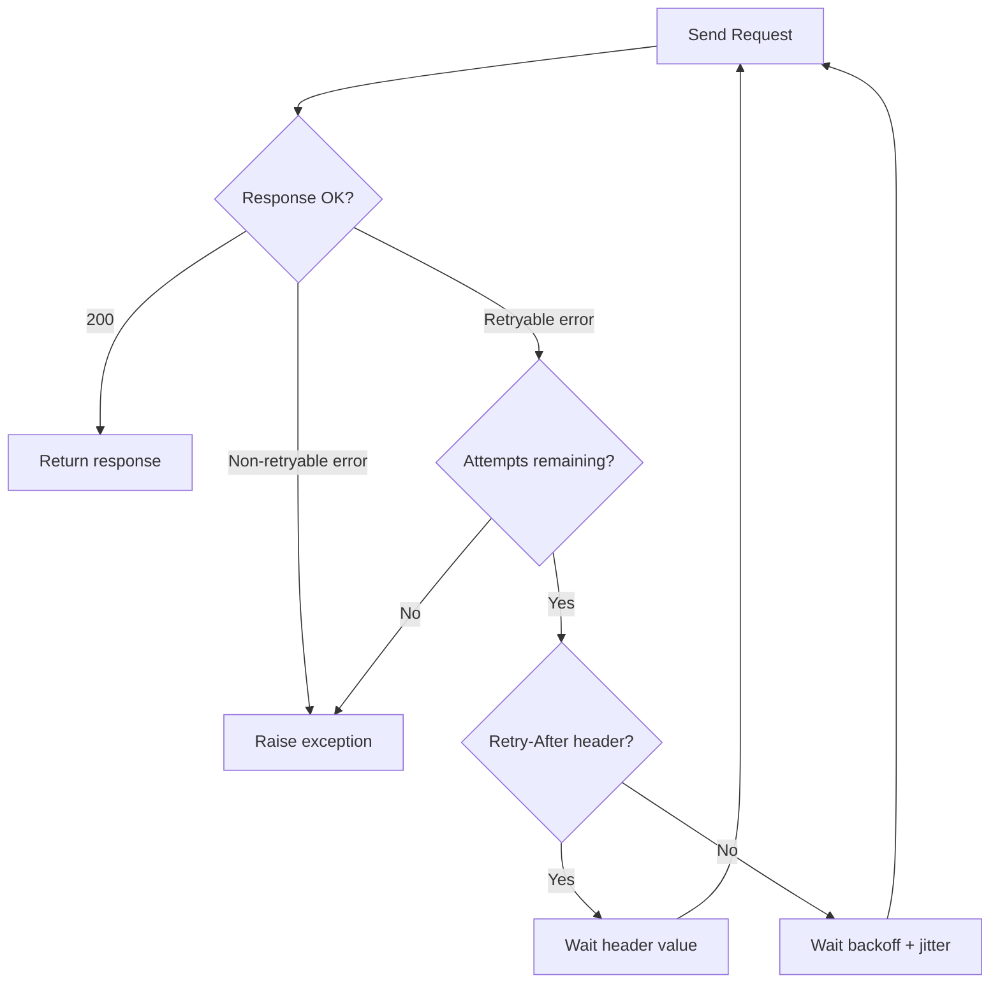

# Retry Logic

safaribooks uses [tenacity](https://tenacity.readthedocs.io/) for automatic retry of failed API requests. This handles transient network errors and server-side issues without manual intervention.

## Retry configuration

| Parameter | API Requests | Asset Downloads |
|-----------|-------------|-----------------|
| Max attempts | 5 | 3 |
| Base delay | 1 second | 1 second |
| Max delay | 60 seconds | 60 seconds |
| Backoff | Exponential | Exponential |
| Jitter | +/- 25% | +/- 25% |

## Exponential backoff

Each retry waits longer than the previous one:

```
Attempt 1: fails → wait ~1s
Attempt 2: fails → wait ~2s
Attempt 3: fails → wait ~4s
Attempt 4: fails → wait ~8s
Attempt 5: fails → raise exception
```

The actual wait time is `min(base * 2^(attempt-1), max_delay)` with jitter applied.

## Jitter

A random factor of +/- 25% is applied to each delay to prevent thundering herd problems when multiple requests fail simultaneously:

```
Base delay: 4s
With jitter: 3s to 5s (uniformly distributed)
```

## Retry-After header

When the server returns a `Retry-After` header (common with 429 responses), safaribooks respects it. The header value overrides the calculated backoff delay, ensuring the client waits the exact amount of time the server requests.

## Retryable status codes

The following HTTP status codes trigger a retry:

| Code | Meaning |
|------|---------|
| `408` | Request Timeout |
| `429` | Too Many Requests |
| `500` | Internal Server Error |
| `502` | Bad Gateway |
| `503` | Service Unavailable |
| `504` | Gateway Timeout |

All other error codes (including 401, 403, 404) raise immediately without retry.

## Flow diagram



:::warning
After all retry attempts are exhausted, the original exception is raised. For API requests this is an `ApiError`; for asset downloads it's a `DownloadError`.
:::
